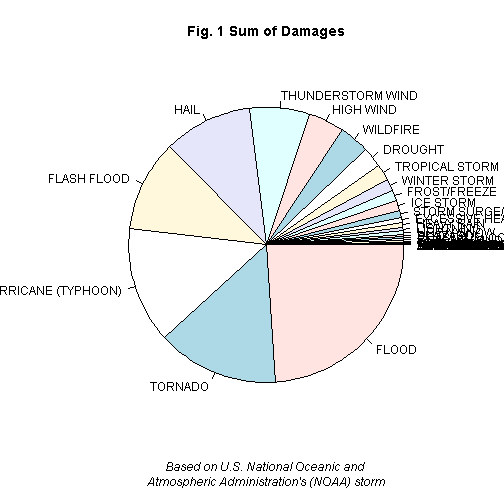
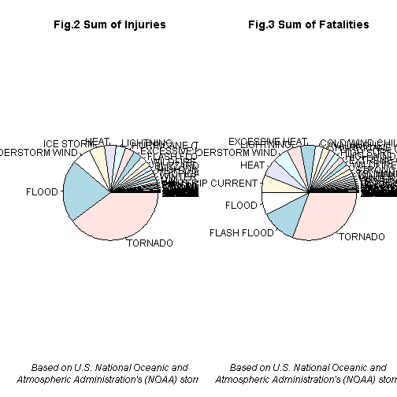

##Synopsis
The weather damange inforamation is collected on U.S. National Oceanic and Atmospheric Administration's (NOAA) storm database. In the database, injuries, fatalities and damages(properies and crop) are recorded by 48 NOAA weather event. The calculation is done by summing total number of damages, injuries and fatalites during all the years.
Before the sum by event, data cleaning applied to: 1. event name mapping to NOAA event name; 2. trim non-standard, non-undertandable damages record. Three Pies were given, to show the most harmful weather event and most econimic damage event.

##Data processing
Data processing include:

*   Reading data from NOAA database
*   Subseting data related to topic
*   Re-mapping reported event to NOAA standard event
*   Calculation
*   Demostrate conclution in figures

### Data processing: Reading data from NOAA record database

```r
x=read.csv('repdata-data-StormData.csv', colClasses = 'character', header=T)

## NOAA database layout
## STATE__           BGN_DATE BGN_TIME TIME_ZONE COUNTY COUNTYNAME STATE  EVTYPE BGN_RANGE BGN_AZI BGN_LOCATI END_DATE END_TIME COUNTY_END COUNTYENDN
##      1                  2      3         4       5       6        7       8     9         10        11        12         13       14          15  
##     *                                                                     *                        
## END_RANGE END_AZI END_LOCATI LENGTH  WIDTH F  MAG FATALITIES INJURIES PROPDMG PROPDMGEXP CROPDMG CROPDMGEXP WFO STATEOFFIC ZONENAMES LATITUDE
##     16       17        18      19      20  21  22         23      24       25        26      27       28       29       30        31    32                         
##                                                *           *       *       *         *       *         *      
## LONGITUDE LATITUDE_E LONGITUDE_ REMARKS REFNUM
##       33        34        35    36         37                                              
#numeric_cols=c(1,5,9,14,16,19,20,21,22,23,34,25,27, 32,33,34,35,37)
#factor_cols =c(4,7,8)

#x[,numeric_cols] = apply(x[,numeric_cols],2, function(y) as.numeric(y))
```

### Data processing: Pick only column that related to the topic and format


```r
y=x[, c(2,8,23,24,25,26,27,28)]
y$FATALITIES= as.numeric(y$FATALITIES)
y$INJURIES= as.numeric(y$INJURIES)
y$PROPDMG= as.numeric(y$PROPDMG)
y$CROPDMG= as.numeric(y$CROPDMG)

standard_event=c("Astronomical Low Tide", "Avalanche", "Blizzard", "Coastal Flood", "Cold/Wind Chill", "Debris Flow", "Dense Fog", "Dense Smoke", "Drought", "Dust Devil", "Dust Storm", "Excessive Heat", "Extreme Cold/Wind Chill", "Flash Flood", "Flood", "Frost/Freeze", "Funnel Cloud", "Freezing Fog", "Hail", "Heat", "Heavy Rain", "Heavy Snow", "High Surf", "High Wind", "Hurricane (Typhoon)", "Ice Storm", "Lake-Effect Snow", "Lakeshore Flood", "Lightning", "Marine Hail", "Marine High Wind", "Marine Strong Wind", "Marine Thunderstorm Wind", "Rip Current", "Seiche", "Sleet", "Storm Surge/Tide", "Strong Wind", "Thunderstorm Wind", "Tornado", "Tropical Depression", "Tropical Storm", "Tsunami", "Volcanic Ash", "Waterspout", "Wildfire", "Winter Storm", "Winter Weather")
standard_event= toupper(standard_event)
```
### Data processing: Subset record that have damages, injures and fatalities reported

```r
y$FATALITIES= as.numeric(y$FATALITIES)
y$INJURIES= as.numeric(y$INJURIES)
y$PROPDMG= as.numeric(y$PROPDMG)
y$CROPDMG= as.numeric(y$CROPDMG)

y$life=ifelse(y$FATALITIES > 0 | y$INJURIES >0, 1, 0)
y$prop = ifelse(y$PROPDMG > 0 | y$CROPDMG > 0,1,0)

y = subset(y, prop + life > 0)
yy=y
yy$EVTYPE = toupper(yy$EVTYPE)
yy$PROPDMGEXP = toupper(yy$PROPDMGEXP)
yy$CROPDMGEXP = toupper(yy$CROPDMGEXP)
yy = subset(yy, PROPDMGEXP %in% c('B', 'K','M') & CROPDMGEXP %in% c('B', 'K','M') )
yy$ev=""

yy$ev = ifelse(yy$EVTYPE %in% standard_event, yy$EVTYPE, "")
yy$trans=0
```
### Data processing: Mapping reported event to NOAA standard event

```r
yy$ev = ifelse(yy$ev == '' & yy$EVTYPE == "THUNDERSTORM WINDS", "Thunderstorm Wind", yy$ev)

yy$ev = ifelse(yy$ev == '' & grepl("TSTM WIND", yy$EVTYPE), "Thunderstorm Wind", yy$ev)
yy$ev = ifelse(yy$ev == '' & grepl("THUNDERSTORM WIND", yy$EVTYPE), "Thunderstorm Wind", yy$ev)
yy$ev = ifelse(yy$ev == '' & grepl("HURRICANE", yy$EVTYPE), "HURRICANE (TYPHOON)", yy$ev)
yy$ev = ifelse(yy$ev == '' & grepl("TYPHOON", yy$EVTYPE), "HURRICANE (TYPHOON)", yy$ev)
yy$ev = ifelse(yy$ev == '' & grepl("TROPICAL STORM", yy$EVTYPE), "TROPICAL STORM", yy$ev)
yy$ev = ifelse(yy$ev == '' & grepl("WINTER STORM", yy$EVTYPE), "WINTER STORM", yy$ev)

yy$ev = ifelse(yy$ev == '' & yy$EVTYPE == "WILD/FOREST FIRE", "Wildfire", yy$ev)
yy$ev = ifelse(yy$ev == '' & yy$EVTYPE == "HIGH WINDS", "HIGH WIND", yy$ev)
yy$ev = ifelse(yy$ev == '' & yy$EVTYPE == "FOG", "Dense Fog", yy$ev)
yy$ev = ifelse(yy$ev == '' & yy$EVTYPE == "HURRICANE", "Hurricane (Typhoon)", yy$ev)
yy$ev = ifelse(yy$ev == '' & yy$EVTYPE == "HURRICANE/TYPHOON", "Hurricane (Typhoon)", yy$ev)
yy$ev = ifelse(yy$ev == '' & yy$EVTYPE == "EXTREME COLD", "Extreme Cold/Wind Chill", yy$ev)
yy$ev = ifelse(yy$ev == '' & yy$EVTYPE == "URBAN/SML STREAM FLD", "Flash Flood", yy$ev)
yy$ev = ifelse(yy$ev == '' & yy$EVTYPE == "TSTM WIND/HAIL", "Ice Storm", yy$ev)
yy$ev = ifelse(yy$ev == '' & yy$EVTYPE == "FLOOD/FLASH FLOOD", "Flash Flood", yy$ev)
yy$ev = ifelse(yy$ev == '' & yy$EVTYPE == "HEAVY SURF", "High Surf", yy$ev)
yy$ev = ifelse(yy$ev == '' & yy$EVTYPE == "WIND", "High Wind", yy$ev)
yy$ev = ifelse(yy$ev == '' & yy$EVTYPE == "FLASH FLOODING", "Flash Flood", yy$ev)
yy$ev = ifelse(yy$ev == '' & yy$EVTYPE == "HEAT WAVE", "HEAT", yy$ev)
yy$ev = ifelse(yy$ev == '' & yy$EVTYPE == "SNOW", "Heavy Snow", yy$ev)
yy$ev = ifelse(yy$ev == '' & yy$EVTYPE == "RIP CURRENTS", "STORM SURGE/TIDE", yy$ev)
yy$ev = ifelse(yy$ev == '' & yy$EVTYPE == "FLOODING", "FLOOD", yy$ev)
yy$ev = ifelse(yy$ev == '' & yy$EVTYPE == "RIVER FLOODING", "FLOOD", yy$ev)
yy$ev = ifelse(yy$ev == '' & yy$EVTYPE == "COASTAL FLOODING", "COASTAL FLOOD", yy$ev)
yy$ev = ifelse(yy$ev == '' & yy$EVTYPE == "THUNDERSTORM WINDS/HAIL", "THUNDERSTORM WIND", yy$ev)
yy$ev = ifelse(yy$ev == '' & yy$EVTYPE == "THUNDERSTORM WINDS HAIL", "THUNDERSTORM WIND", yy$ev)
yy$ev = ifelse(yy$ev == '' & yy$EVTYPE == "STORM SURGE", "STORM SURGE/TIDE", yy$ev)
yy$ev = ifelse(yy$ev == '' & yy$EVTYPE == "RIVER FLOOD", "FLOOD", yy$ev)
yy$ev = ifelse(yy$ev == '' & yy$EVTYPE == "URBAN FLOOD", "FLOOD", yy$ev)
yy$ev = ifelse(yy$ev == '' & yy$EVTYPE == "URBAN FLOODING", "FLOOD", yy$ev)
yy$ev = ifelse(yy$ev == '' & yy$EVTYPE == "HEAVY SURF/HIGH SURF", "HIGH SURF", yy$ev)
yy$ev = ifelse(yy$ev == '' & yy$EVTYPE == "STRONG WINDS", "STRONG WIND", yy$ev)
yy$ev = ifelse(yy$ev == '' & yy$EVTYPE == "LIGHT SNOW", "HEAVY SNOW", yy$ev)
yy$ev = ifelse(yy$ev == '' & yy$EVTYPE == "LANDSLIDE", "FLASH FLOOD", yy$ev)
yy$ev = ifelse(yy$ev == '' & yy$EVTYPE == "FLASH FLOODING/FLOOD", "FLASH FLOOD", yy$ev)
yy$ev = ifelse(yy$ev == '' & yy$EVTYPE == "FLASH FLOOD/FLOOD", "FLASH FLOOD", yy$ev)
yy$ev = ifelse(yy$ev == '' & yy$EVTYPE == "THUNDERSTORM WINDSS", "THUNDERSTORM WIND", yy$ev)
yy$ev = ifelse(yy$ev == '' & yy$EVTYPE == "TROPICAL STORM JERRY", "TROPICAL STORM", yy$ev)
yy$ev = ifelse(yy$ev == '' & yy$EVTYPE == "TORNADO F0", "TORNADO", yy$ev)
yy$ev = ifelse(yy$ev == '' & yy$EVTYPE == "HIGH WINDS/COLD", "HIGH WIND", yy$ev)
yy$ev = ifelse(yy$ev == '' & yy$EVTYPE == "HEAVY RAINS/FLOODING", "FLOOD", yy$ev)
yy$ev = ifelse(yy$ev == '' & yy$EVTYPE == "GUSTNADO", "TORNADO", yy$ev)
yy$ev = ifelse(yy$ev == '' & yy$EVTYPE == "THUNDERSTORMS", "THUNDERSTORM WIND", yy$ev)

yy$ev = ifelse(yy$ev == '' & grepl("DRY", yy$EVTYPE), "DROUGHT", yy$ev)
yy$ev = ifelse(yy$ev == '' & grepl("DROUGHT", yy$EVTYPE), "DROUGHT", yy$ev)
yy$ev = ifelse(yy$ev == '' & grepl("SURF", yy$EVTYPE), "HIGH SURF", yy$ev)
yy$ev = ifelse(yy$ev == '' & grepl("HAIL", yy$EVTYPE), "HAIL", yy$ev)
yy$ev = ifelse(yy$ev == '' & grepl("THUNDERSTORMS", yy$EVTYPE), "THUNDERSTORM WIND", yy$ev)
yy$ev = ifelse(yy$ev == '' & grepl("HEAVY RAIN", yy$EVTYPE), "HEAVY RAIN", yy$ev)
yy$ev = ifelse(yy$ev == '' & grepl("WIND", yy$EVTYPE), "STRONG WIND", yy$ev)
yy$ev = ifelse(yy$ev == '' & grepl("FIRES", yy$EVTYPE), "WILDFIRE", yy$ev)
yy$ev = ifelse(yy$ev == '' & grepl("FLOOD", yy$EVTYPE), "FLOOD", yy$ev)
yy$ev = ifelse(yy$ev == '' & grepl("RAIN", yy$EVTYPE), "HEAVY RAIN", yy$ev)
yy$ev = ifelse(yy$ev == '' & grepl("FREEZE", yy$EVTYPE), "FROST/FREEZE", yy$ev)

yy$ev = ifelse(yy$ev == '' & grepl("HEAT", yy$EVTYPE), "HEAT", yy$ev)
yy$ev = ifelse(yy$ev == '' & grepl("TORNADO", yy$EVTYPE), "TORNADO", yy$ev)
yy$ev = ifelse(yy$ev == '' & grepl("IC", yy$EVTYPE), "COLD/WIND CHILL", yy$ev)

yy$ev = ifelse(yy$EVTYPE == "", "OTHER", yy$ev)
yy$ev = toupper(yy$ev)

yyy=yy
yyy$ev=as.factor(yy$ev)
yyy$event.mapped=ifelse(yyy$ev==toupper(yyy$EVTYPE), 0,1)
```

### Data processing: Calcuate measuremenat numbers

```r
yyy$prop.dmg = yyy$PROPDMG *( ifelse( yyy$PROPDMG == 'B', 1000000000, ifelse(yyy$PROPDMGEXP=='M', 1000000, ifelse(yyy$PROPDMGEXP=='K', 1000,1))))
yyy$crop.dmg = yyy$CROPDMG *( ifelse( yyy$CROPDMG == 'B', 1000000000, ifelse(yyy$CROPDMGEXP=='M', 1000000, ifelse(yyy$CROPDMGEXP=='K', 1000,1))))

yyy$dmg = yyy$prop.dmg + yyy$crop.dmg
```

## Result
### Show the damages


```r
par(mfcol = c(1,1))
xt.dmg = xtabs(data=yyy,   crop.dmg + prop.dmg ~ ev)
pie(sort(xt.dmg))
title(main='Fig. 1 Sum of Damages',xlab="Based on U.S. National Oceanic and \nAtmospheric Administration's (NOAA) storm",
      font.lab = 3)
```

 

Fig. 1 shows *Flood* has the greatest economic consequences.

### Show the injuries and fatalities


```r
xt.INJURIES = xtabs(data = yyy, INJURIES ~ ev)
xt.FATALITIES = xtabs(data = yyy, FATALITIES ~ ev)

par(mfcol = c(1,2))
pie(sort(xt.INJURIES));
title(main='Fig.2 Sum of Injuries', xlab="Based on U.S. National Oceanic and \nAtmospheric Administration's (NOAA) storm",
      font.lab = 3)
pie(sort(xt.FATALITIES))
title(main='Fig.3 Sum of Fatalities',xlab="Based on U.S. National Oceanic and \nAtmospheric Administration's (NOAA) storm",
      font.lab = 3)
```

 


Fig.2 and Fig.3 give the event that are most harmful with respect to population health

*Tornado* cuases most injuries and fatalities amonst all the NOAA weather event

